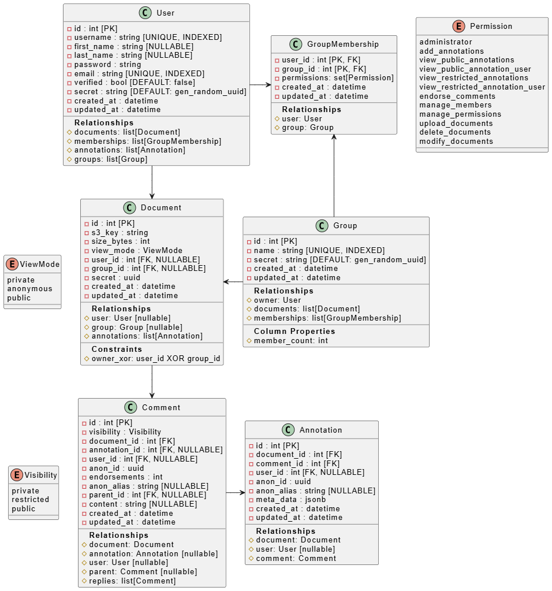

> ❓ This document was acknowledged by and presented to the stakeholder on September 1, 2025

# 🏛 1 Architecture

The entire application will be built with scalability and maintainability in mind.  
All major components are separated into different services, allowing for independent scaling.    

## 🗄 1.1 Database

The data storage will be handled by a single PostgreSQL database instance.  
This database will store all user data, annotations, and metadata.  

The UML diagram below shows an initial database layout.

This schema allows for a semi-flexible permission system to restrict specific data like usernames or restricted annotations to certain groups of users.
Users can be part of multiple groups with different permissions.
Documents can be related to individual users or groups with annotations of different types for each document.

## ⚡ 1.2 Redis

A Redis instance will be used for caching and event management.  
The websocket based event system in the backend will use Redis for cross-instance communication.

## 🗂 1.3 File Storage

An S3 compatible object storage (MinIO) will be used for storing document files.  
This allows an easier overview of documents and enables seamless migration to a cloud provider in the future.

## 🖥 1.4 Backend

The backend will be built using FastAPI as a web framework and SQLAlchemy as an ORM for database interactions.  
It will provide a RESTful API with CRUD operations for managing the database entities.  
A websocket-based event system will be implemented for real-time updates.

Most of the core FastAPI dependencies like authentication, database sessions and pagination logic will be reused from a personal project template for FastAPI + SQLModel.

## 🎨 1.5 Frontend

The frontend will be developed using SvelteKit mostly as a Single Page Application (SPA).  
It will communicate with the backend via the RESTful API and websockets for real-time updates.  

It will provide a UI for user, group, and document management with an extensive document editor supporting annotations.  
The frontend will be built with different translations and light-/dark mode in mind, so they can be configured easily later.  
During development, only the English translation will be available.

# 🚀 2 Deployment

| Feature                  | Single VPS                   | Cloud Provider               |
|---------------------------|------------------------------|------------------------------|
| Components on same server | Yes                          | Separate services            |
| Cost                      | Low (3€-50€/month)          | High (>100€-200€)            |
| Scalability               | Limited                       | High                         |
| Availability         | ❌ No                        | ✅ Yes                        |
| Suitable user count       | ~500–5000                     | >5000                        |

## 💻 2.1 Single VPS

In this setup, all components (database, Redis, backend, frontend) will be deployed on a single Virtual Private Server (VPS).  
This allows for a simple and cost-effective deployment but does not provide high availability or scalability.
It is likely the most suitable option for early usage. Hardware upgrades could push the active user count to ~5000.  

This hosting method is ideal for deploying the application on university infrastructure.  
It can also be preconfigured for easy on-demand deployment (e.g., for other universities or schools).

## ☁️ 2.2 Cloud Provider

All individual components of the app can be deployed to separate cloud provider services.  
The entire application could live in an AWS ecosystem where each component scales horizontally based on demand (database scales vertically).  
While incurring higher costs, this setup provides high availability and scalability. Suitable for >5000 active users and theoretically capable of handling millions.

This hosting method is mostly relevant if the application is publicly available from the university.

# 🛠 3 Implementation & Development Plan

The development will be split into multiple phases.  
The software will be developed as an Open Source project with a non-commercial license to allow transparency and easy extension. GitHub will be used as the development platform.

The plan is laid out over a 6-month period with **20 hours** of work per **month**.  
Priorities might change based on feedback provided during regular meetings with the stakeholder.  

### 📊 Implementation Phases Summary

| Phase | Duration         | Goal                                           | Key Deliverables |
|-------|-----------------|-----------------------------------------------|-----------------|
| 0     | 2 weeks         | Define requirements                           | Feature list    |
| 1     | 2 weeks         | Setup development environment                 | CI/CD, DB, Redis, MinIO |
| 2     | 4 weeks         | Develop backend                               | REST API, Websockets |
| 3     | 4 weeks         | MVP frontend                                  | Basic UI, editor |
| 4     | 2 weeks         | Frontend styling                              | Light/dark mode, animations |
| 5     | 2 weeks         | Testing                                       | User feedback, bug reports |
| 6     | 2-6 weeks       | Reiteration                                   | New features, fixes |
| 7     | Remaining       | Documentation & deployment                     | User/Developer guides, production setup |

## 📋 3.0 Phase 0 - Planning (2 weeks)

Communication with the stakeholder will yield a list of core features to be implemented by the end of the semester.  
A comprehensive list of optional and non-optional features will be created.  
The goal is a clear understanding of software requirements and expectations.

## 🏗 3.1 Phase 1 - Development Environment (2 weeks)

Setup of the development environment including:

- Automatic CI/CD workflows
- Database migrations
- Test environments
- Application skeletons
- Development instances (database, Redis, MinIO)

Goal: Fully functional environment for seamless development and testing.

## 🔧 3.2 Phase 2 - Backend (4 weeks)

Development of the backend with all major features:

- RESTful API with CRUD operations for users, groups, documents, and annotations
- Websocket-based event system for real-time updates

Goal: Fully functional backend ready for frontend integration.

## 🖱 3.3 Phase 3 - Frontend MVP (4 weeks)

Development of a minimal viable product of the frontend:

- Basic UI for user, group, and document management
- Simple document editor supporting annotations
- Websocket-based real-time updates

Goal: Functional frontend for backend interaction and demonstration.

## 🎨 3.4 Phase 4 - Frontend Style Pass (2 weeks)

Improve UI/UX with:

- Translations
- Light/dark mode support
- Animations, gradients, and other visual enhancements

Goal: Polished, visually appealing frontend.

## ✅ 3.5 Phase 5 - Testing (2 weeks)

Initial testing in a controlled environment or small course:

- Real-world usage
- Feedback questionnaires
- Bug reports

Goal: Validate functionality and usability.

## 🔄 3.6 Phase 6 - Reiteration (2-6 weeks)

Implement additional features and fix issues from testing.

## 📚 3.7 Phase 7 - Documentation and Deployment (Leftover Time)

Create final documentation:

- User manuals
- API documentation
- Developer guides

Prepare software for deployment:

- Production environment setup
- Server configuration
- Ensure readiness for real-world use
